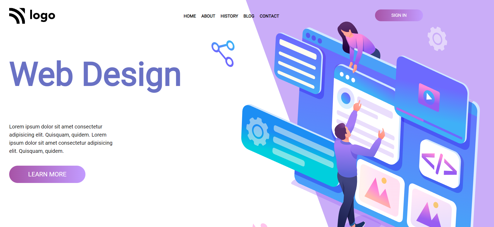

# HTML Project 8

> This is my eighth project of HTML and CSS and It is a static page but I learned alot.

 #

## Project Web page

In this project I learned about transform property in css and its rotate function with translateX function which translate the content in x-axis.

[Visit this website](https://abhi-project-8.netlify.app/)

#

To see my work visit my [Portfolio](https://portfolio-of-abhishek.netlify.app)

